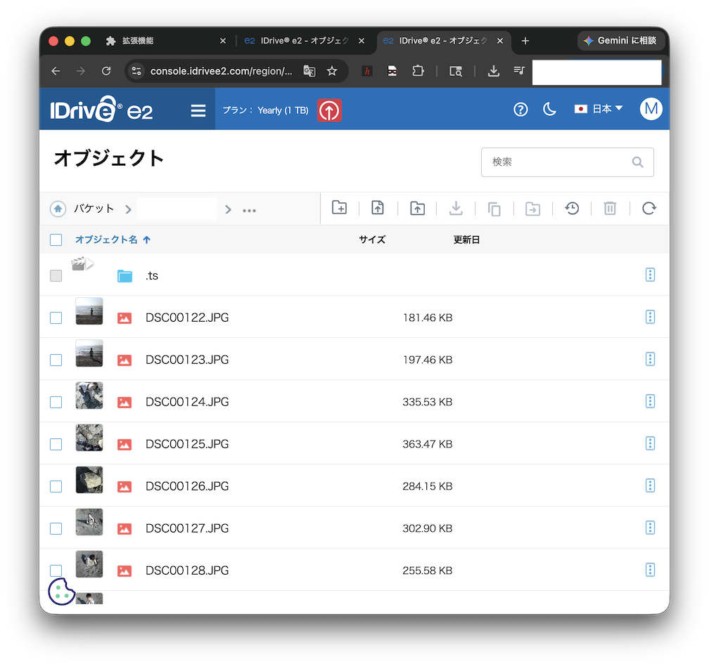
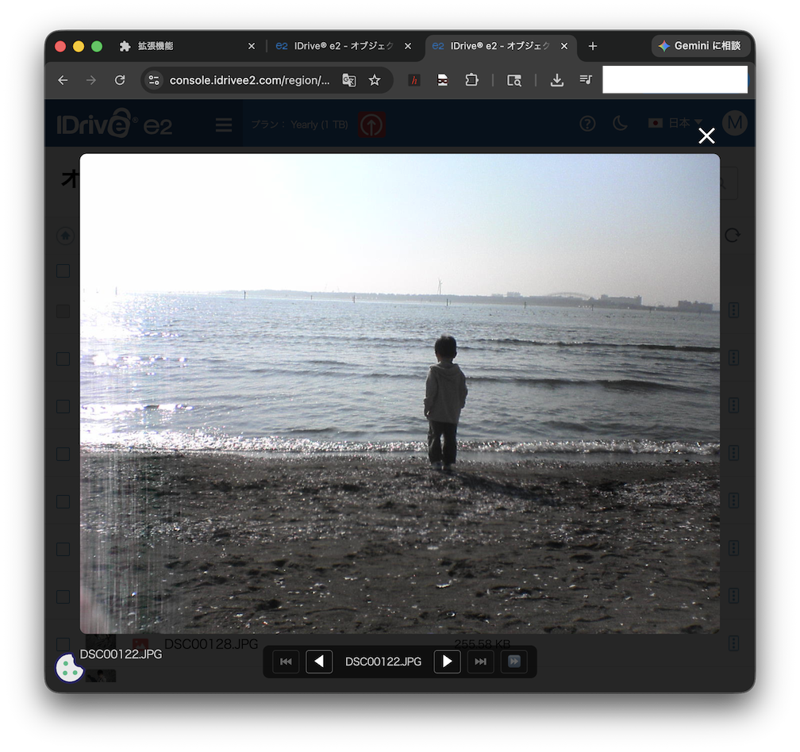
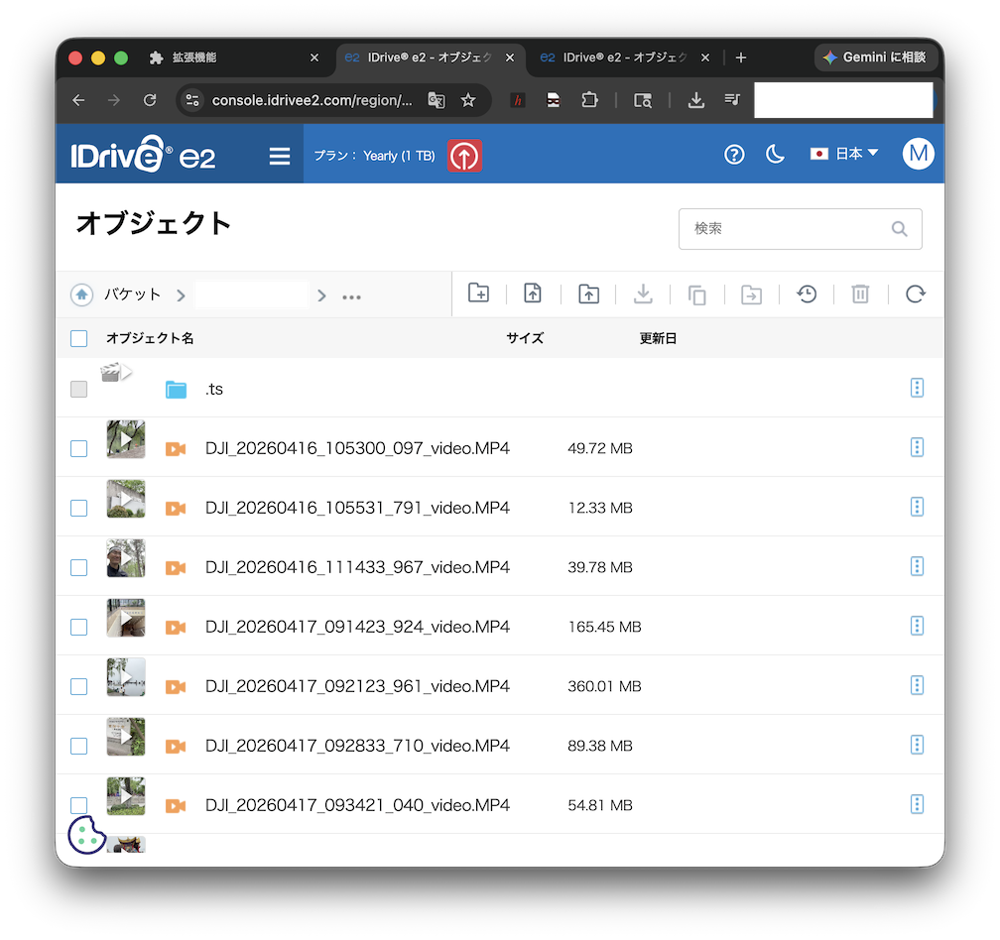
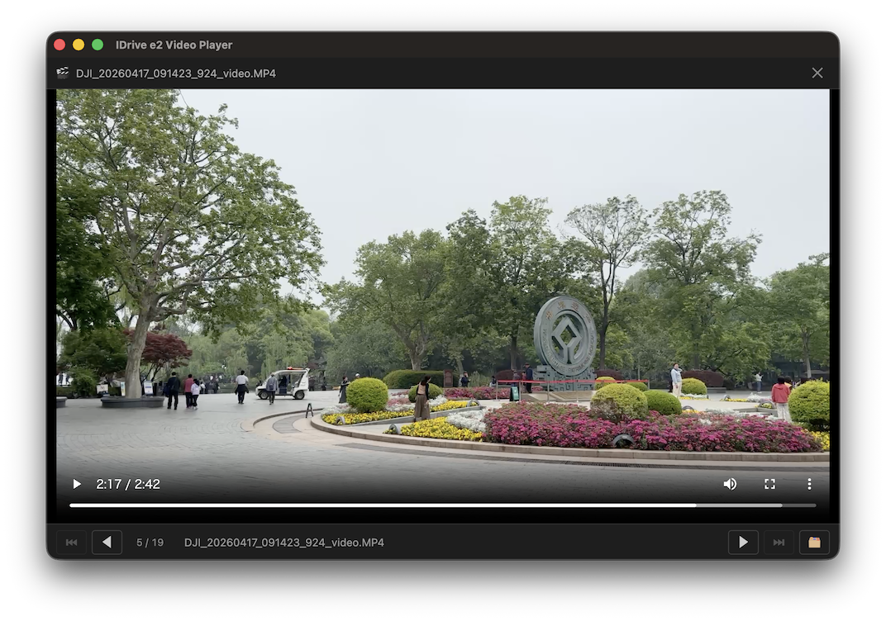

# IDrive e2 サムネイルビューアー Chrome拡張

[](https://chrome.google.com/webstore)
[](https://developer.chrome.com/docs/extensions/)

IDrive e2 バケットビューアーに画像・動画の**サムネイル**を表示する Chrome 拡張機能です。

S3互換APIのSigV4署名をブラウザ内で計算し、PreSigned URLを生成してサムネイルを表示します。









## 機能

- ✅ **画像サムネイル表示** — JPG、PNG、GIF、WebP など主要フォーマットに対応
- ✅ **動画サムネイル表示** — MP4、MOV、WebM、AVI などに対応（▶再生ボタン付き）
- ✅ **PresignedURL自動生成** — クライアント側 SigV4 署名（HMAC-SHA256）で安全にアクセス
- ✅ **画像オーバーレイ表示** — 画像クリックで拡大表示
- ✅ **動画ダウンロード** — 動画クリックで新規タブ → ダウンロード
- ✅ **新規タブ表示モード** — 設定で画像も新規タブで開くよう選択可能
- ✅ **キャッシュ** — PresignedURL をキャッシュして無駄な再生成を防止
- ✅ **仮想スクロール対応** — Angular CDK の仮想スクロールにも対応

## サムネイル配置方法

- バケットの画像と同じ階層に `.ts` フォルダを作成し、下記のようにサムネイル画像を配置してください。

  例）
    - 元画像

      `Photo/2026/06/01/IMG_12345.JPG`
    - サムネイル

      `Photo/2026/06/01/.ts/IMG_12345.JPG.jpg`

## 使い方

1. Chrome拡張のアイコンをクリック → ポップアップを開く
2. **Access Key ID** と **Secret Access Key** を入力
3. **S3 リージョン** を選択（デフォルト: ap-northeast-1）
4. 「保存」をクリック
5. IDrive e2 コンソールのバケットビューアーを開く → サムネイルが表示されます

### 操作

| 操作 | 動作 |
|------|------|
| 画像サムネイルをクリック | オーバーレイ拡大表示（設定で新規タブも可） |
| 動画サムネイルをクリック | 新規タブで開く（ブラウザがダウンロード） |

> **注意**: 動画はIDrive e2コンソールのCSP制限によりページ内で再生できません。
> クリックするとダウンロードまたはブラウザの動画ビューアーで開かれます。

## インストール

1. このリポジトリをクローンまたはZIPをダウンロード
2. Chrome で `chrome://extensions` を開く
3. 右上の **デベロッパーモード** を ON
4. **「パッケージ化されていない拡張機能を読み込む」** をクリック
5. 展開したフォルダを選択

## アーキテクチャ

```
extension/
├── manifest.json           # Manifest V3 設定
├── content.js              # Content Script（DOM解析、サムネイル追加）
├── lib/
│   └── sigv4.js            # SigV4 署名実装（HMAC-SHA256）
├── popup.html              # 設定画面
├── popup.js                # 設定保存ロジック
├── styles.css              # サムネイルスタイル
└── icon128.png             # 拡張アイコン

server/
└── presign-server.py       # （オプション）サーバーサイド署名API
```

## SigV4 実装のポイント

S3 PreSignedURL の生成でつまずきやすいポイントを以下にまとめます：

### 1. ペイロードハッシュ
```javascript
// ✅ 正解
const payloadHash = 'UNSIGNED-PAYLOAD';

// ❌ 間違い
const payloadHash = sha256('').hexdigest();  // e3b0c44...
```

### 2. クエリパラメータ
`X-Amz-Content-Sha256` はクエリ文字列に**含めない**。

### 3. CanonicalRequest の空行
```javascript
// ✅ 正解（canonicalHeadersの末尾\n + joinの\n = 1空行）
['GET', uri, qs, headers, signedHeaders, payload].join('\n')

// ❌ 間違い（headersの\n + ''の\n = 2空行）
['GET', uri, qs, headers, '', signedHeaders, payload].join('\n')
```

### 4. エンドポイント
パススタイルURLを使用する（バーチャルホストはIDrive e2では署名不一致）。
```
https://s3.{region}.idrivee2.com/{bucket}/{key}
```

## ライセンス

MIT
