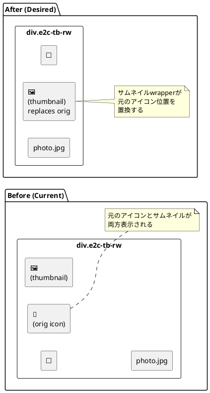
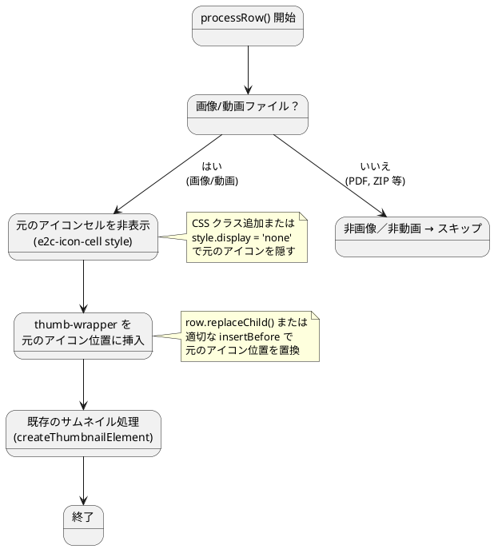
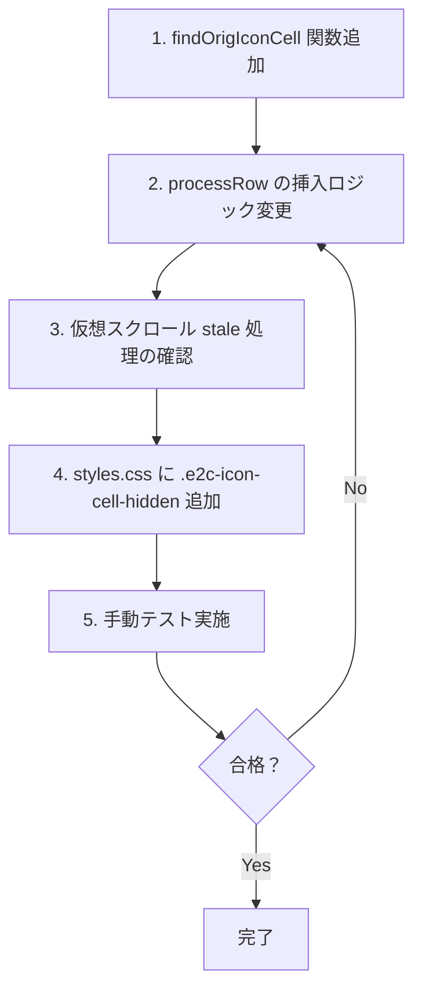

# サムネイル表示位置変更 詳細仕様書

> **プロジェクト**: idrive-e2-thumbnail-extension
> **Issue**: [#35 サムネイルの表示場所](https://github.com/takano-hermes/idrive-e2-thumbnail-extension/issues/35)
> **作成日**: 2026-06-08
> **策定プロセス**: Multi-Agent Workflow（Architect + コードリーディング → 詳細仕様書作成）
> **優先度**: 高
> **見積規模**: 小（単一関数の修正＋スタイル調整）

---

## 1. 概要

### 1.1 変更目的

現在、IDrive e2 コンソールの行（`.e2c-tb-rw`）において、サムネイル画像は**新しい列（セル）**としてチェックボックスの直後に挿入されている。その結果、IDrive が本来描画するファイル種別アイコン（`.e2c-td` セル内のアイコン）と、本拡張機能が追加するサムネイルが**両方表示**される状態となっている。

Issue #35 の要求は、**サムネイル画像が存在する場合（取得できた場合）は元のアイコンの表示をなくし、その場所にサムネイル画像を表示する**ことである。

言い換えると：「新しい列を追加する」方式から「**元のアイコンセルを置き換える**」方式に変更する。

### 1.2 変更範囲

| 範囲 | 内容 |
|------|------|
| **変更するファイル** | `content.js`（1箇所: `processRow` 内の挿入ロジック） |
| **変更するCSS** | `styles.css`（元のアイコンを隠すスタイル追加＋wrapper位置調整） |
| **新規ファイル** | なし |
| **API / データ構造の変更** | なし |
| **設定項目の変更** | なし |

### 1.3 前提条件

- サムネイル画像は `.ts/{filename}.jpg` として S3 バケットに保存済みであること（既存の PresignedURL 生成フローで取得）
- サムネイルがない場合（PresignedURL 取得失敗時）はフォールバック表示（絵文字 🎬/🖼️）が行われること（既存の `showFallback()` を維持）
- 仮想スクロール（CDK Virtual Scroll）による DOM 再利用が発生すること（既存の処理フローを維持）

---

## 2. 現状の問題点

### 2.1 視覚的な問題

現在の表示イメージ（テキスト表現）：

```
┌────┬────┬──────────────┬──────────────────┐
│ ☐  │ 🖼️ │  photo.jpg   │  (ファイルサイズ…) │
│    │ 🎞️ │              │                  │
│    │ ←新 │              │                  │
│    │ 規列│              │                  │
└────┴────┴──────────────┴──────────────────┘
  ☐=チェック    └ サムネイル └ ファイル名
                    🎞️（新規）
                 まだ元の
                 アイコン
                 が残って
                 いる
```

問題点：
1. **サムネイルと元のアイコンが両方表示される** — ユーザーにとって冗長で混乱を招く
2. **横方向のスペースを無駄に消費する** — 1行あたりサムネイルセル（40px＋padding）＋元のアイコンセル（~40px）の合計約96pxがアイコン/サムネイルのために占有される
3. **IDrive 本来のレイアウトから逸脱** — サムネイルがチェックボックス直後という非標準的な位置に表示される

### 2.2 コード上の問題

| 問題 | 詳細 |
|------|------|
| `processRow` の挿入位置 | `row.insertBefore(thumbEl, checkContainer.nextSibling)` — 新しい列を挿入しているだけ |
| 元のアイコンセルの削除漏れ | 元のアイコンセル（`e2c-td` クラス）を削除/非表示にする処理がない |
| CSS での非表示設定なし | 元のアイコンを隠す CSS ルールが存在しない |
| フォールバック時の重複 | サムネイルがない場合、元のアイコン（IDrive のファイル種別アイコン）とフォールバック絵文字の両方が表示されうる |

---

## 3. 要件定義

### 3.1 機能要件

| ID | 要件 | 優先度 |
|----|------|--------|
| R1 | 画像/動画ファイルの行において、サムネイル画像が正常に取得できた場合は元のファイル種別アイコンを非表示にし、**その位置にサムネイルを表示する** | P0 |
| R2 | サムネイルが取得できなかった場合（フォールバック時）も、元のアイコンを非表示にし、代わりにフォールバック絵文字（🎬/🖼️）を**同じ位置**に表示する | P0 |
| R3 | 画像/動画以外のファイル（PDF、ZIP 等）には影響を与えない — 元のアイコンをそのまま表示 | P0 |
| R4 | サムネイルのサイズ・クリック動作・再生ボタン表示などの既存機能は維持する | P0 |
| R5 | 仮想スクロールによる DOM 再利用が発生しても、正しい位置にサムネイルが表示される | P1 |
| R6 | SPA 遷移（prefix 変更）時にも正しく動作する | P1 |

### 3.2 非機能要件

| ID | 要件 |
|----|------|
| N1 | 元のアイコンが一瞬表示されてからサムネイルに置き換わるチラつきを防ぐため、CSS レベルで初期状態から元のアイコンを非表示にしておく |
| N2 | 変更によるパフォーマンスへの影響を最小限にする（DOM 操作は既存の `processRow` 内に閉じる） |
| N3 | 変更は既存のテスト容易性を損なわない（関数の責務は変わらない） |

### 3.3 境界条件

| 条件 | 期待動作 |
|------|---------|
| 画像/動画ファイルでサムネイル取得成功 | 元のアイコン非表示 + サムネイル画像表示（サムネイルwrapperを元のアイコン位置に配置） |
| 画像/動画ファイルでサムネイル取得失敗 + objKey フォールバックも失敗 | 元のアイコン非表示 + フォールバック絵文字（🎬/🖼️）表示 |
| 画像/動画ファイルで HEIC/HEIF（ブラウザ非対応） | 元のアイコン非表示 + フォールバック絵文字（🖼️）表示 |
| 非画像・非動画ファイル | 何もしない（元のアイコンそのまま） |
| フォルダ行（拡張子なし/末尾 `/`） | 何もしない（`processRow` でスキップ済み） |

---

## 4. DOM 構造の変更

### 4.1 現在の DOM 構造（Before）

```
div.e2c-tb-rw
├── div.e2c-check-container          # チェックボックス
│   └── input[type="checkbox"]
├── div.e2c-td.e2c-thumb-wrapper     # ← 本拡張機能が新規追加したサムネイル列
│   └── img.e2c-thumb-img
│       └── src="presigned-url..."
├── div.e2c-td                       # ← IDrive が描画する元のアイコンセル
│   └── (ファイル種別アイコン、img または svg)
├── div.e2c-os-name                  # ファイル名列
│   └── span[title="photo.jpg"]
│       └── "photo.jpg"
├── ...                              # その他のセル（サイズ、更新日等）
```
**問題点**: 2つのアイコン/画像要素が横並びに存在する

### 4.2 変更後の DOM 構造（After）

```
div.e2c-tb-rw
├── div.e2c-check-container          # チェックボックス
│   └── input[type="checkbox"]
├── div.e2c-td.e2c-thumb-wrapper     # ← 元のアイコンセルの位置に配置（置換）
│   ├── img.e2c-thumb-img            # サムネイル画像（取得成功時）
│   │   └── src="presigned-url..."
│   └── span.e2c-play-btn            # ▶ 再生ボタン（動画の場合のみ）
│   └── span.e2c-thumb-fallback      # フォールバック絵文字（取得失敗時のみ）
├── div.e2c-os-name                  # ファイル名列（変更なし）
│   └── span[title="photo.jpg"]
│       └── "photo.jpg"
├── ...                              # その他のセル（変更なし）
```

**変更点**:
1. `div.e2c-td.e2c-thumb-wrapper` の挿入位置を **元のアイコンセルの代わり** に変更
2. 元のアイコンセル（`div.e2c-td` のうちチェックコンテナと `.e2c-os-name` の間にあるもの）は非表示（`display:none`）または削除
3. サムネイルwrapperは元のアイコンセルが占有していたピクセル位置に配置される

### 4.3 PlantUML: before/after シーケンス



### 4.4 PlantUML: サムネイル配置ロジックの状態遷移



---

## 5. 変更箇所・実装詳細

### 5.1 ファイル: `content.js` — `processRow` 関数（line 742-787）

#### 5.1.1 変更内容

**変更前（現在のコード）**:

```javascript
function processRow(row) {
  if (processedRows.has(row)) {
    log('processRow: SKIP - already processed');
    return;
  }
  processedRows.add(row);

  const filename = getFilename(row);
  log('processRow: filename?', filename);
  if (!filename) {
    log('processRow: filename is null/empty, row HTML:', row.innerHTML.slice(0, 200));
    return;
  }

  // 仮想スクロール対応: 既存のサムネイルが正しいファイル名かを確認
  const existingWrapper = row.querySelector('.e2c-thumb-wrapper');
  if (existingWrapper) {
    const img = existingWrapper.querySelector('img');
    if (img && img.alt === filename) {
      log('processRow: SKIP - thumbnail already matches', filename);
      return;
    }
    log('processRow: REMOVE stale thumbnail (was', img?.alt, ', now', filename + ')');
    existingWrapper.remove();
  }

  const ext = getExtension(filename);
  const isImage = CONFIG.imageExts.has(ext);
  const isVideo = CONFIG.videoExts.has(ext);
  log('processRow: ext=', ext, 'isImage=', isImage, 'isVideo=', isVideo);
  if (!isImage && !isVideo) {
    log('processRow: SKIP - not image/video');
    return;
  }

  log('processRow: adding thumbnail for', filename, '(ext:', ext, ')');

  const { region, bucket, prefix } = parseURL();
  const thumbEl = createThumbnailElement(filename, ext, isVideo, bucket, prefix, region);

  const checkContainer = row.querySelector('.e2c-check-container');
  if (checkContainer && checkContainer.nextSibling) {
    row.insertBefore(thumbEl, checkContainer.nextSibling);   // ← 新しい列として挿入
  } else {
    row.insertBefore(thumbEl, row.firstChild);
  }
}
```

**変更後**:

```javascript
function processRow(row) {
  if (processedRows.has(row)) {
    log('processRow: SKIP - already processed');
    return;
  }
  processedRows.add(row);

  const filename = getFilename(row);
  log('processRow: filename?', filename);
  if (!filename) {
    log('processRow: filename is null/empty, row HTML:', row.innerHTML.slice(0, 200));
    return;
  }

  // 仮想スクロール対応: 既存のサムネイルが正しいファイル名かを確認
  const existingWrapper = row.querySelector('.e2c-thumb-wrapper');
  if (existingWrapper) {
    const img = existingWrapper.querySelector('img');
    if (img && img.alt === filename) {
      log('processRow: SKIP - thumbnail already matches', filename);
      return;
    }
    log('processRow: REMOVE stale thumbnail (was', img?.alt, ', now', filename + ')');
    existingWrapper.remove();
  }

  const ext = getExtension(filename);
  const isImage = CONFIG.imageExts.has(ext);
  const isVideo = CONFIG.videoExts.has(ext);
  log('processRow: ext=', ext, 'isImage=', isImage, 'isVideo=', isVideo);
  if (!isImage && !isVideo) {
    log('processRow: SKIP - not image/video');
    return;
  }

  log('processRow: adding thumbnail for', filename, '(ext:', ext, ')');

  const { region, bucket, prefix } = parseURL();
  const thumbEl = createThumbnailElement(filename, ext, isVideo, bucket, prefix, region);

  // ★★★ 変更箇所 ★★★
  // 元のアイコンセルを特定して非表示にする
  const origIconCell = findOrigIconCell(row);
  if (origIconCell) {
    origIconCell.style.display = 'none';
    // 元のアイコンセルの直前にサムネイルwrapperを挿入（replace的な動作）
    row.insertBefore(thumbEl, origIconCell);
  } else {
    // フォールバック: 元のアイコンセルが見つからない場合は checkContainer の後に挿入
    const checkContainer = row.querySelector('.e2c-check-container');
    if (checkContainer && checkContainer.nextSibling) {
      row.insertBefore(thumbEl, checkContainer.nextSibling);
    } else {
      row.insertBefore(thumbEl, row.firstChild);
    }
  }
}

/**
 * 行内の元のファイル種別アイコンセルを特定する
 * IDrive e2 の行構造:
 *   div.e2c-check-container
 *   div.e2c-td           ← これが元のアイコンセル（クラス名は e2c-td のみ、特定の識別子なし）
 *   div.e2c-os-name
 *
 * @param {Element} row - div.e2c-tb-rw 要素
 * @returns {Element|null} 元のアイコンセル要素、見つからない場合は null
 */
function findOrigIconCell(row) {
  // 行内の全 e2c-td セルを取得
  const cells = row.querySelectorAll(':scope > div.e2c-td');
  for (const cell of cells) {
    // 自分自身（e2c-thumb-wrapper）は除外
    if (cell.classList.contains('e2c-thumb-wrapper')) continue;
    // check-container でも os-name でもない td が元のアイコンセル
    if (cell.classList.contains('e2c-check-container')) continue;
    if (cell.classList.contains('e2c-os-name')) continue;
    return cell;
  }
  return null;
}
```

#### 5.1.2 `findOrigIconCell` の設計根拠

IDrive e2 の各行のセルは、特定の意味クラス（`e2c-check-container`, `e2c-os-name`）を持つものと、持たないもの（`e2c-td` のみ）が存在する。元のファイル種別アイコンは `e2c-td` クラスのみを持つセルである。

代替案と選択理由：

| 代替案 | 問題点 |
|--------|--------|
| CSS セレクタ `:scope > div.e2c-td:not(.e2c-check-container):not(.e2c-os-name):not(.e2c-thumb-wrapper)` | IDrive の DOM 構造に強く依存、IDrive 側の変更に弱い |
| `row.children[1]`（インデックス固定） | 仮想スクロールでの DOM 構造変化に弱い |
| `e2c-td:first-of-type`（thumb-wrapper除外） | 上記のセレクタよりは堅牢だが、セレクタが増える |
| **`findOrigIconCell()` として関数分離**（採用） | 意味的に明確、行構造の変更時に修正が1箇所で済む、テスト容易 |

### 5.2 ファイル: `content.js` — `createThumbnailElement` 関数（line 239-371）

**変更なし**。

`createThumbnailElement` 関数はサムネイル要素の作成のみに責務を限定し、DOM への挿入は行わない。この責務分離を維持する。

### 5.3 ファイル: `styles.css` — 新規スタイル追加

#### 5.3.1 元のアイコンを初期状態から非表示にするスタイル

```css
/* ★★★ 追加 ★★★
 * 画像/動画ファイルの行で元のアイコンを初期非表示にする
 * チラつき防止のため、CSS ロード時点で適用する
 */
div.e2c-tb-rw > div.e2c-td:not(.e2c-check-container):not(.e2c-os-name):not(.e2c-thumb-wrapper) {
  display: none;
}
```

**設計根拠**:
- `display: none` で元のアイコンを完全に非表示にする（`visibility: hidden` ではない — スペースを確保しない）
- サムネイルwrapper（`.e2c-thumb-wrapper`）を元のアイコン位置に挿入するため、スペースが確保される必要がある
- 画像/動画ファイル以外の行ではこのセレクタは適用されない（該当行には `e2c-thumb-wrapper` が存在しないため、実際にはすべての行の元アイコンが隠れてしまう — **対策が必要**）

**⚠ 補足**: 上記のセレクタは**すべての行**の元アイコンセルにマッチしてしまい、画像/動画以外の行のアイコンも非表示にしてしまう。そのため、この CSS アプローチは不適切。

#### 5.3.2 正しいアプローチ: CSS + インラインスタイルの併用

CSS では単に準備し、実際の非表示は JavaScript の `processRow` 内で行う。

```css
/* styles.css に追加 */
.e2c-icon-cell-hidden {
  display: none !important;
}
```

そして `processRow` 内で `origIconCell.classList.add('e2c-icon-cell-hidden')` を呼ぶ。

**画像/動画の行のみ**に適用されるため、他のファイル種別に影響しない。

### 5.4 仮想スクロール対応

#### 5.4.1 既存の処理（変更なしで対応可能）

仮想スクロールで DOM 行が再利用される場合、`processRow` は以下の順で処理する：

1. `processedRows` WeakSet で重複チェック（既存）
2. `existingWrapper` （`.e2c-thumb-wrapper`）の `img.alt` と現在のファイル名を照合（既存）
3. 一致 → スキップ（何もしない）
4. 不一致（stale）→ `existingWrapper.remove()` を実行（既存）

**問題**: `existingWrapper.remove()` でサムネイルwrapperを削除しても、元のアイコンセルは `style.display = 'none'` のままになる。
新しく画像/動画ファイルが行に割り当てられる場合は問題ないが、**非画像・非動画ファイル（PDF、ZIP等）が割り当てられた場合**、拡張子チェックで早期 return されるため、元のアイコンが非表示のままアイコン消失となる。

**対策**: stale 検出時に元のアイコンセルの `display` を必ずリセットする。`findOrigIconCell` 呼び出しは後続の処理と重複するため、一度だけ呼び出して結果を再利用する。

#### 5.4.2 更新された stale 処理

`processRow` の stale 検出部分に元のアイコンセルの復元処理を追加：

```javascript
// ★★★ stale 検出時の更新 ★★★
// 既存のサムネイルが別のファイルのものだった場合
const existingWrapper = row.querySelector('.e2c-thumb-wrapper');
if (existingWrapper) {
  const img = existingWrapper.querySelector('img');
  if (img && img.alt === filename) {
    log('processRow: SKIP - thumbnail already matches', filename);
    return;
  }
  log('processRow: REMOVE stale thumbnail (was', img?.alt, ', now', filename + ')');
  existingWrapper.remove();

  // ★★★ 元のアイコンを復元（後続の早期return対策） ★★★
  // 非画像・非動画ファイルへの切り替え時、早期returnされると元のアイコンが
  // display:none のまま残り、アイコン消失になるため必ず復元する
  const staleOrigIcon = findOrigIconCell(row);
  if (staleOrigIcon) {
    staleOrigIcon.style.display = '';
  }
}
```
**設計判断**: stale 検出時に元のアイコンセルを必ず復元する（`display=''`）。これにより：

1. **画像/動画ファイル → 画像/動画ファイル**: 復元後、後続処理で再度 `findOrigIconCell` → `display='none'` 設定。表示上は一瞬の変化だが実用上問題ない
2. **画像/動画ファイル → 非画像・非動画ファイル**: 復元された元のアイコンがそのまま表示される（正常）
3. **`findOrigIconCell` が2回呼ばれる問題**: 一度目の呼び出し（stale処理内）と二度目の呼び出し（新規サムネイル挿入処理内）で重複が発生する。以下の最適化も可能：

```javascript
// ★★★ 最適化版: 1度だけ origIconCell を取得 ★★★
const existingWrapper = row.querySelector('.e2c-thumb-wrapper');
if (existingWrapper) {
  const img = existingWrapper.querySelector('img');
  if (img && img.alt === filename) return;
  existingWrapper.remove();
}

const origIconCell = findOrigIconCell(row);

if (!isImage && !isVideo) {
  // origIconCell は既存のまま（表示状態は初期状態）
  return;
}

if (origIconCell) {
  origIconCell.style.display = 'none';
  row.insertBefore(thumbEl, origIconCell);
} else {
  // フォールバック
  const checkContainer = row.querySelector('.e2c-check-container');
  row.insertBefore(thumbEl, checkContainer ? checkContainer.nextSibling : row.firstChild);
}
```

**推奨**: 最初の実装では理解しやすさを優先し、stale 処理内で明示的に復元するシンプルな方式を採用する。後日のリファクタリングで最適化版に切り替えてもよい。

### 5.5 SPA 遷移対応（line 847-858）

URL 変更（`?prefix=...` 変更）を 2 秒間隔の polling で検知し、以下の処理を行う：

```javascript
setInterval(() => {
  if (location.href !== lastUrl) {
    lastUrl = location.href;
    processedRows = new WeakSet();
    presignedUrlCache = new Map();
    // 既存のサムネイル要素をすべて削除（古いprefixの画像が残る問題対策）
    document.querySelectorAll('.e2c-thumb-wrapper').forEach(el => el.remove());
    setTimeout(processAllRows, 1000);
  }
}, 2000);
```

**変更なし**: 上記処理ですべてのサムネイルwrapperが削除される。新しい `processRow` 呼び出しで、正しい元のアイコン位置にサムネイルが再挿入される。

### 5.6 2秒間隔の定期チェック（line 860-868）

```javascript
setInterval(() => {
  if (s3Ready) {
    processedRows = new WeakSet();
    processAllRows();
  }
}, 2000);
```

**変更なし**: 仮想スクロールで再利用された行を再処理する仕組み。新しい `processRow` ロジックでもそのまま機能する。

---

## 6. エッジケース対応

### 6.1 元のアイコンセルが見つからない場合

| 状況 | 対応 |
|------|------|
| IDrive の DOM 構造が変更され、`findOrigIconCell` が `null` を返す | フォールバックとして従来の `checkContainer.nextSibling` 位置に挿入し、元のアイコンはそのまま表示する |
| 特定の行に元のアイコンセル自体が存在しない | 同様にフォールバック |

```javascript
const origIconCell = findOrigIconCell(row);
if (origIconCell) {
  origIconCell.style.display = 'none';
  row.insertBefore(thumbEl, origIconCell);
} else {
  // フォールバック: 従来の位置に挿入
  const checkContainer = row.querySelector('.e2c-check-container');
  row.insertBefore(thumbEl, checkContainer ? checkContainer.nextSibling : row.firstChild);
}
```

### 6.2 仮想スクロール高速スクロール時

| 状況 | 対応 |
|------|------|
| DOM 行が高速に再利用される | `processAllRows` は `MutationObserver` と `scroll` イベント（300ms デバウンス）+ 2秒定期チェックの3重でカバー。各呼び出しで `processedRows` WeakSet による重複防止が効く |

### 6.3 SPA 遷移の高速連打

| 状況 | 対応 |
|------|------|
| ユーザーがフォルダを高速に切り替える | 2秒 polling 間隔では見逃す可能性。ただし `mutationObserver` による real-time 検知も動作中。最悪の場合、古いサムネイルが一瞬表示されるが、次の polling で修正される |

### 6.4 サムネイル読み込み中の表示

| 状況 | 対応 |
|------|------|
| PresignedURL 生成が非同期で完了するまで | `loadThumbnail()`（line 264）が setTimeout 100ms 後に実行。その間、サムネイルwrapper は空の img（背景色 `#f0f0f0`）が表示される。元のアイコンは非表示のため、空白が一瞬見える |

**改善提案（任意）**: サムネイル読み込み中は `img` に `loading` アニメーション（スピナー）を表示すると UX が向上するが、本 Issue のスコープ外とする。

### 6.5 フォルダ行（.ts/ フォルダ自体）

フォルダ行は拡張子がないため `getExtension` が空文字を返し、`isImage` も `isVideo` も `false` となる。`processRow` は早期リターンするため、元のアイコンはそのまま表示される。

```
const ext = getExtension(filename);        // '' (フォルダ名)
const isImage = CONFIG.imageExts.has(ext); // false
const isVideo = CONFIG.videoExts.has(ext); // false
if (!isImage && !isVideo) return;          // → 早期リターン
```

### 6.6 空の行 / 読み込み中の行

`getFilename(row)` が `null` を返す場合、早期リターンする（既存の動作）。

### 6.7 行内に thumb-wrapper が既に存在する場合の整合性

| シナリオ | 処理 |
|----------|------|
| 正しいサムネイル（img.alt === filename 一致） | スキップ。元のアイコンは既に非表示 |
| stale サムネイル（img.alt !== filename） | wrapper を削除 → 新しいサムネイルを作成 → `findOrigIconCell` → 非表示 → 挿入 |

**注意**: stale 検出時に wrapper を削除した後、必ず元のアイコンセルの `display` を `''`（空文字）にリセットする。これにより、次のファイルが非画像・非動画ファイルだった場合に早期 return されても、元のアイコンが復元された状態で表示される。

---

## 7. テスト項目

### 7.1 ユニットテスト（単体確認）

| # | テスト項目 | 確認内容 | 合格条件 |
|---|-----------|---------|---------|
| 1 | `findOrigIconCell` が正しいセルを返す | モック行を作成し、`e2c-td` を持つセルの中で `e2c-check-container` / `e2c-os-name` / `e2c-thumb-wrapper` 以外の要素を返すこと |
| 2 | `findOrigIconCell` が見つからない場合 | モック行に該当セルがない場合、`null` を返すこと |
| 3 | 「サムネイル取得成功」のシナリオ | `processRow` → `findOrigIconCell` でセル特定 → `style.display = 'none'` が設定される → `row.insertBefore(thumbEl, origIconCell)` で適切な位置に挿入される |
| 4 | 「サムネイル取得失敗・フォールバック」のシナリオ | 同上。フォールバック絵文字（🎬/🖼️）が表示され、元のアイコンは非表示 |
| 5 | 「非画像・非動画ファイル」のシナリオ | `processRow` が早期リターンし、元のアイコンがそのまま表示される |
| 6 | stale サムネイル検出と置換 | wrapper が削除され、新しい thumb が正しい位置に挿入される |

### 7.2 結合テスト

| # | テスト項目 | 手順 | 合格条件 |
|---|-----------|------|---------|
| 7 | 実際の IDrive e2 コンソールでサムネイル表示 | 任意のバケットを開き、画像ファイルを表示 | 元のアイコンが非表示、サムネイル画像が元のアイコン位置に表示される |
| 8 | 動画ファイルの表示 | 動画ファイルを含むバケットを表示 | ▶再生ボタンがサムネイル上に表示される。元のアイコンは非表示 |
| 9 | サムネイルがないファイルの表示 | サムネイル画像（`.ts/{name}.jpg`）が存在しないファイルを表示 | フォールバック絵文字が表示される。元のアイコンは非表示 |
| 10 | 非対応ファイル（PDF、ZIP） | 画像/動画以外のファイルを含むバケットを表示 | 元のアイコンがそのまま表示される。影響なし |

### 7.3 仮想スクロールテスト

| # | テスト項目 | 手順 | 合格条件 |
|---|-----------|------|---------|
| 11 | スクロールで行が再利用される | ファイルが多いバケットで高速スクロール | スクロール後も正しいサムネイルが各行の正しい位置に表示される |
| 12 | 画像/動画 → 非画像/動画 切り替え | 画像ファイルとPDF/ZIPが混在するバケットでスクロール | 非画像・非動画ファイル行では元のアイコンが正常に表示され、消失しない |
| 13 | 非画像/動画 → 画像/動画 切り替え | PDF/ZIPが表示されていた行に画像ファイルが再利用される | サムネイルが正しく生成され、元のアイコンは非表示になる |
| 14 | 高速スクロール時のチラつき | 手動で高速スクロール | 元のアイコンが一瞬見えるチラつきがない |

### 7.4 SPA 遷移テスト

| # | テスト項目 | 手順 | 合格条件 |
|---|-----------|------|---------|
| 15 | フォルダ移動 | サイドバーから別のフォルダに移動 | 新しいフォルダのファイルに正しいサムネイルが表示される |
| 16 | フォルダ移動 → 戻る | フォルダを移動した後に元のフォルダに戻る | 元のフォルダのサムネイルが再表示される |
| 17 | URL 直接操作 | ブラウザのアドレスバーで `?prefix=` を変更して Enter | 新しい prefix のファイルにサムネイルが表示される |

### 7.5 リグレッションテスト

| # | テスト項目 | 確認内容 |
|---|-----------|---------|
| 18 | オーバーレイ表示 | サムネイルクリックでオーバーレイが開くこと（既存機能） |
| 19 | 動画ポップアップ | 動画サムネイルクリックでポップアップが開くこと（既存機能） |
| 20 | ナビゲーションバーの動作 | オーバーレイ内で前後ナビゲーションが動作すること（既存機能） |
| 21 | 設定変更の即時反映 | `accessKeyId` 変更時に `processAllRows` が再実行されること（既存機能） |
| 22 | HEIC/HEIF フォールバック | HEIC ファイルのサムネイルクリックで適切なフォールバック UI が表示されること（既存機能） |

### 7.6 テスト実施手順（手動）

```bash
# 1. Chrome で IDrive e2 コンソールを開く
# 2. 拡張機能のコンテンツスクリプトが動作していることを確認
# 3. 各テストケースを実施
# 4. Chrome DevTools Console で [IDriveThumb] ログを確認
```

### 7.7 合格/不合格基準

| レベル | 基準 |
|--------|------|
| **必須合格** | P0テスト項目（#3, #4, #5, #7, #8, #9, #10, #11, #13）がすべて合格 |
| **推奨合格** | P1テスト項目（#12, #14, #15）のうち80%以上が合格 |
| **リグレッション** | テスト項目 #16-20 に不合格がないこと |

---

## 8. 実装手順

### 8.1 変更ステップ



### 8.2 ロールバック手順

1. `content.js` の `processRow` 関数を git checkout HEAD で元に戻す
2. `styles.css` の新しいクラス `.e2c-icon-cell-hidden` を削除
3. 拡張機能をリロード

---

## 9. 変更による影響範囲

| 影響対象 | 影響度 | 備考 |
|---------|--------|------|
| `createThumbnailElement` | なし | サムネイル要素作成ロジックは変更なし |
| `showOverlay` / `updateOverlayContent` / `navigatePrev` / `navigateNext` | なし | オーバーレイ表示はサムネイル位置と無関係 |
| `buildFileList` | なし | ファイル一覧構築ロジックは変更なし |
| `fetchFolderSiblings` / `initFolderNavigation` / `navigatePrevFolder` / `navigateNextFolder` | なし | フォルダナビゲーションは変更なし |
| `parseURL` / `getFilename` / `getExtension` / `getPresignedUrl` | なし | ユーティリティ関数は変更なし |
| `processAllRows` | なし | 呼び出し元は変更なし |
| `startObserver` / `init` | なし | 初期化フローは変更なし |
| SPA transition (2秒 polling + 2秒定期チェック) | なし | タイミングロジックは変更なし |
| `styles.css` | 小 | 1ルール追加のみ |
| **`processRow`** | **中** | 挿入ロジックを書き換え。`findOrigIconCell` を新規追加 |
| **テスト** | **中** | 表示位置変更に伴うテスト項目の追加が必要 |

---

## 10. 付録

### 10.1 コード差分サマリー

**追加**: `findOrigIconCell(row)` — 新規関数（~20行）
**変更**: `processRow` の挿入ロジック（~5行書き換え）
**追加**: `styles.css` に `.e2c-icon-cell-hidden` クラス（1行）
**変更範囲**: 合計 ~26行の追加/変更

### 10.2 参考リンク

- [Issue #35](https://github.com/takano-hermes/idrive-e2-thumbnail-extension/issues/35)
- [現在の content.js processRow](https://github.com/takano-hermes/idrive-e2-thumbnail-extension/blob/main/content.js#L742-L787)
- [既存仕様書: SPEC_NAVIGATION.md](./SPEC_NAVIGATION.md)

### 10.3 改訂履歴

| 日付 | 版 | 変更者 | 変更内容 |
|------|-----|--------|---------|
| 2026-06-08 | 1.0 | (本仕様書) | 初版作成 |
